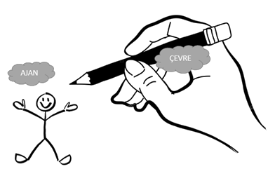

### Pekiştirmeli Öğrenme Araştırma ve Çalışma Grubu

Merhaba,

Pekiştirmeli Öğrenme Araştırma ve Çalışma Grubu, çevrimiçi Discord buluşmaları düzenleyerek, Richard S. Sutton ve Andrew G. Barto tarafından hazırlanan “Reinforcement Learning: An Introduction” kitabının özetini çıkartmaktadır. Eş zamanlı olarak çeşitli Pekiştirmeli Öğrenme uygulamaları yapan ekip, bu çalışmalarını GitHub üzerinde açık kaynaklı olarak paylaşmaktadır. Türkçe ve ayrıntılı bir şekilde özetlenen kitabın bölümlerini, araştırma yapanlara katkı sağlaması için sayfada ve blog üzerinde yakın zamanda paylaşmayı planlamaktadır.

#### Linkler

* [RL: An Introduction](http://incompleteideas.net/book/the-book.html) - Kaynak Kitap
* [Pommerman](https://www.pommerman.com/) - NIPS 2018 yarışması

#### Pekiştirmeli Öğrenmeye Giriş Serisi

1. [Pekiştirmeli Öğrenmeye Giriş](reinforcement-learning-intro-1)
1. [Multi Armed Bandits](reinforcement-learning-intro-2)
